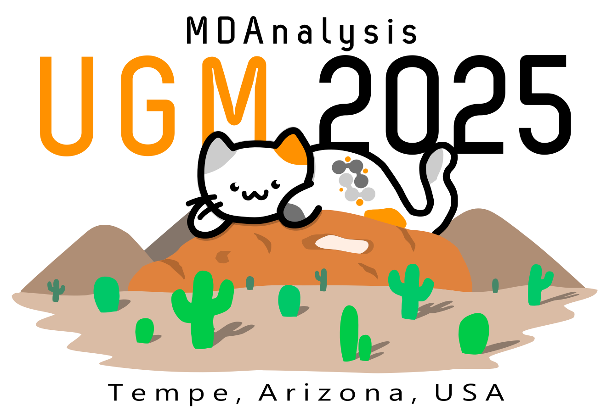

# MDAnalysis UGM 2025

The [2025 MDAnalysis User Group Meeting](https://www.mdanalysis.org/pages/ugm2025/) (UGM) will bring together users and developers of the MDAnalysis package from different communities. Our goal is to foster an interdisciplinary opportunity to connect for researchers and developers across biomolecular simulations, soft matter, biophysics and more. This repository includes relevant materials for the UGM.

## When and Where
### **November 9-11th 2025**

[Center for Biological Physics](https://cbp.asu.edu/) at [Arizona State University](https://www.asu.edu/), [550 E Tyler Mall](https://www.google.com/maps/place/Physical+Sciences+Center+F-Wing/@33.4214777,-111.9311025,18z/data=!4m6!3m5!1s0x872b08dc4ac6af5f:0x213722c63856da62!8m2!3d33.4210023!4d-111.9313576!16s%2Fg%2F11c2mc_myh), PSF 186, Tempe, AZ 85287, USA

Paid parking is available in the Tyler Street Parking Structure and other on-campus parking structures.

### Contacting the organizers during the meeting

If you need to contact the organizers **send a message to the UGM2025 [#contact-organizers](https://discord.com/channels/807348386012987462/1436034423559557140) discord channel**. Someone will then get in touch with you and help you solve the issue. For example, message if you cannot get into a building, if you're lost on ASU campus, or you have another urgent problem.

You need to sign up for the [MDAnalysis discord server](https://discord.com/channels/807348386012987462/1418333436988358715). Use the invite link https://discord.gg/fXTSfDJyxE .

### Travel instructions

See [TRAVEL](TRAVEL.md) for **detailed instructions** for how to get to the conference venue (Physical Sciences Building F, [Google Maps coordinates 33.4214777,-111.9311025](https://www.google.com/maps/place/Physical+Sciences+Center+F-Wing/@33.4214777,-111.9311025,18z/data=!4m6!3m5!1s0x872b08dc4ac6af5f:0x213722c63856da62!8m2!3d33.4210023!4d-111.9313576!16s%2Fg%2F11c2mc_myh), plus-code: C3C9+CF Tempe, Arizona) or use the overview map below ([PDF](./assets/maps/asu_map_tempe_current.pdf)).

## Code of Conduct
All members of the MDAnalysis community and participants in this UGM are expected to abide by the MDAnalysis [Code of Conduct](https://www.mdanalysis.org/conduct/) (CoC). If at any point you see or experience something that makes you uncomfortable, you may fill out the [reporting form](https://www.mdanalysis.org/conduct/#how-to-report) or speak with any of the CoC points of contact for the UGM ([Jenna Swarthout Goddard](mailto:community@mdanalysis.org) (online) and [Yuxuan Zhuang](mailto:yuxuan.zhuang@mdanalysis.org) (in-person)); the CoC points of contact will identify themselves at the start of the event.

## UGM Schedule Overview

| Day   | Location                     | Description       |
|-------|--------------------------|-------------------|
| Day 1 | PSF 186             | Keynote (morning), Talks (morning) & streaming workshop (afternoon) |
| Day 2 | PSH 350             | Keynote (morning), Talks (morning, afternoon) & MDAnalysis master classes (afternoon) |
| Day 3 | PSF 186 | Visualization workshop (morning), Talks (midday), OpenFF / OpenFE / OpenADMET workshops (afternoon) |

See the [Full Schedule](SCHEDULE.pdf) for details.

<!---
*The full program ([mdaUGM2024-agenda.pdf](./mdaUGM2024-agenda.pdf)) and abstracts book ([mdaUGM2024-abstracts.pdf](./mdaUGM2024-abstracts.pdf)) are included in this repo.* 
-->

## Health and Safety
We are committed to providing a safe, comfortable, and healthy environment for the MDAnalysis UGM and have looked to local and international entities and other organizations in the open source community to develop onsite safety measures for UGM attendees.

## IT Logistics

### Connecting to the Wireless Network/WiFi

* The **asu guest** wireless network is available to all participants but limited in capabilities.
* The **eduroam** network is available to anyone whose institution participates in eduroam. If you need to set up anything, talk to your institution's IT support before coming to ASU.
* The **asu** network is only available to members of Arizona State University.

See [CONNECTIVITY](CONNECTIVITY.md) for details.

### GitHub account and Code Spaces

In order to participate in some of the workshops you will need to be able to run a [Code Space](https://github.com/features/codespaces) instance in your personal GitHub account. This requires a GitHub account and either free or paid credits. For most users, the monthly free Codespaces allowance on their *individual* accounts (120 core hours, 15 GB storage) should be sufficient. 

## License
Written materials are provided under the [CC-BY-4.0 SA license](LICENSE.md).

The MDAnalysis UGM 2025 conference logo was created by Fiona Naughton ([@fiona-naughton](https://github.com/fiona-naughton)). The MDAnalysis logo and the MDAnalysis UGM 2025 conference logo may not be used without written permission by the MDAnalysis Project. 
[NumFOCUS](https://numfocus.org/) as the fiscal sponsor of MDAnalysis holds all rights on the MDAnalysis logos and any future derivatives. See the file [https://github.com/MDAnalysis/branding/blob/main/logos/LICENSE](https://github.com/MDAnalysis/branding/blob/main/logos/LICENSE) for more details.

Any other logos are properties of their owners and may only be used according to their owners' terms.

## Acknowledgements

The MDAnalysis UGM has been made possible in part by:

### Chan Zuckerberg Initiative (CZI)

Chan Zuckerberg Initiative (CZI) grants; 2022-253062 and DAF2021-237663 (grant DOI https://doi.org/10.37921/426590wiobus), from the Chan Zuckerberg Initiative DAF, an advised fund of Silicon Valley Community Foundation (funder DOI 10.13039/100014989)
 
<a href="https://chanzuckerberg.com/">

<a/>

### National Science Foundation
  
U.S. National Science Foundation award [2311372](https://www.nsf.gov/awardsearch/showAward?AWD_ID=2311372) _Elements: Streaming Molecular Dynamics Simulation Trajectories for Direct Analysis: Applications to Sub-Picosecond Dynamics in Microsecond Simulations_

<a href="https://www.nsf.gov/">

<a/>

### Center for Biological Physics at Arizona State University

The Center for Biological Physics at Arizona State University provided the venue and logistical support.

<a href="https://cbp.asu.edu/">

<a/>

### NumFOCUS

MDAnalysis also thanks [NumFOCUS](https://www.numfocus.org/) for its continued support as our fiscal sponsor.

<a href="https://numfocus.org/">

<a/>

