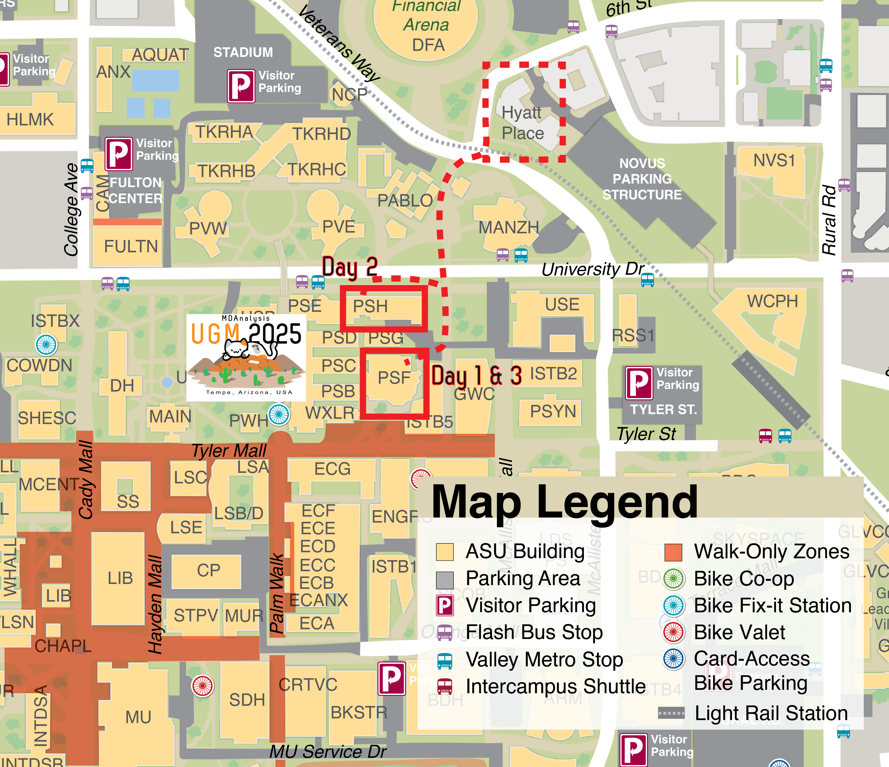
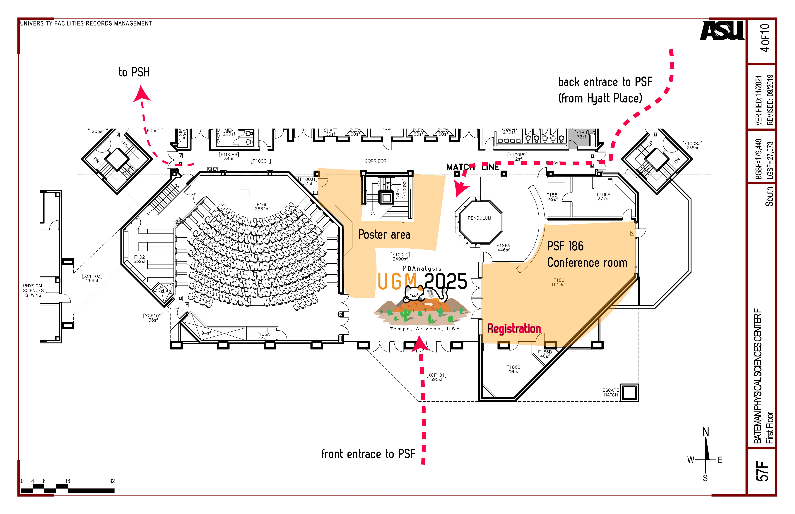
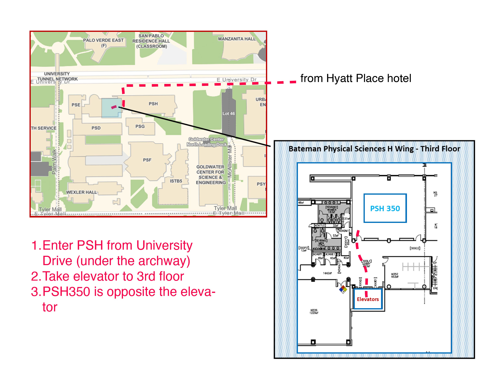
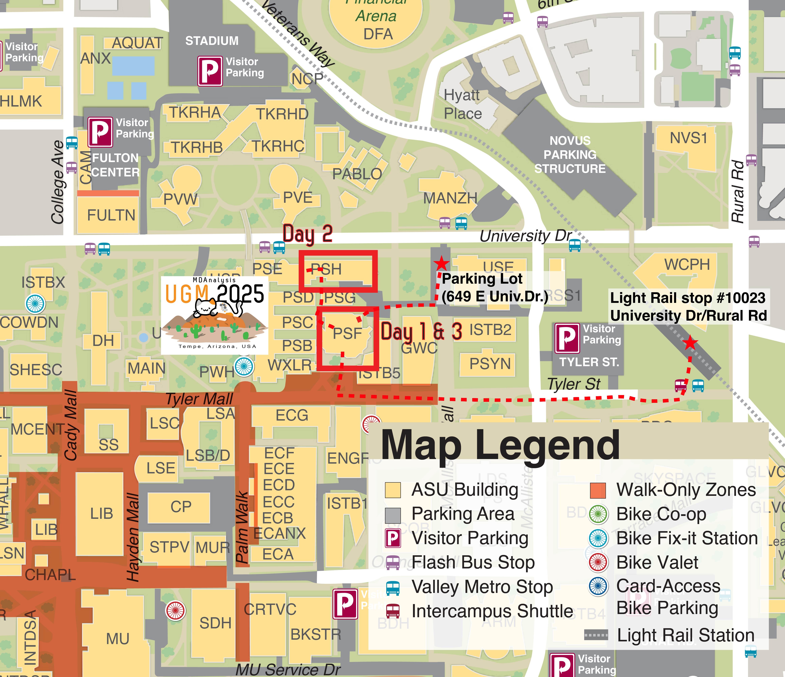

# Travel

The 2025 MDAnalysis UGM (User Group Meeting) will be held in-person
across 3 days, November 9th-11th, 2025, at [Arizona State University](https://www.asu.edu/).

[Center for Biological Physics](https://cbp.asu.edu/) 
Arizona State University 
George M. Bateman Physical Sciences Center F Wing ([Google Maps coordinates 33.4214777,-111.9311025](https://www.google.com/maps/place/Physical+Sciences+Center+F-Wing/@33.4214777,-111.9311025,18z/data=!4m6!3m5!1s0x872b08dc4ac6af5f:0x213722c63856da62!8m2!3d33.4210023!4d-111.9313576!16s%2Fg%2F11c2mc_myh), plus-code: *C3C9+CF Tempe, Arizona*) 
550 Tyler Mall 
Tempe, AZ 85287

## From PHX Airport

Phoenix Sky Harbor [PHX](https://www.skyharbor.com/) airport has direct connections to all major hubs in the US.

PHX airport is 5.5 miles (10 minutes by car/rideshare) from the workshop venue.

### Public transport (Light Rail)

The [Valley Metro Light Rail][Light Rail] connects the airport to Tempe along a
West-East axis. If your destination is near a Light Rail stop then
public transport works well:

1. Take the free [PHX Sky Train][] from the terminal to the **44th St/Washington**
Metro Rail stop.
2. Walk from the Sky Train stop to the Light Rail stop (all inside the 44th St
Sky Train structure).
3. Buy a ticket at the ticket machine near the exit escalators to the Light
Rail stop.
4. At the [44th St/Washington stop][LightRail44thSt] (Stop #10018) take the
*east-bound* Light Rail (direction Mesa, Gilbert Rd/Main St).
5. The stop closest to the Hyatt Place Hotel and the workshop venue is
**University Dr/Rural Rd** (Stop #10023). If you want to get off closer to
downtown Tempe get off one stop earlier at **Veterans Way/College Ave** (Stop #10025).
6. Walk to your destination. (See below)

### Car/rideshare

To get from the airport to anywhere in Tempe either take a cab (traditional or self-driving
Waymo) or rideshare (Lyft, Uber).

## From Hyatt Place Tempe Hotel to ...

The [Hyatt Place Tempe Phoenix University Hotel](https://www.hyatt.com/en-US/hotel/arizona/hyatt-place-tempe-phoenix-university) is 5 mins walk from the conference venue. 

See the map ([PDF](./assets/maps/MDAUGM2025_ASU_Tempe.pdf) for download) and follow the path from **Hyatt Place** to **PSF** for *Day 1 & 3* and to **PSH** for *Day 2**. See step-by-step descriptions below the map.

### ... Physical Sciences F Building (Day 1 and 3)

On Sunday and Tuesday (Day 1 and 3), talks and workshops will be held in the **Physical Sciences F** (PSF) Building in **room PSF 186** on the ground floor.

1. Cross Veterans Way at the traffic light and walk South towards University Drive.
2. Cross University Drive at the traffic light.
3. Walk South and turn right (West) into the loading dock area between Physical Sciences Building H (PSH) and PSF.
4. Enter PSF on its Northeast corner through the entrance behind the loading dock and the freight elevator.
5. Walk through the foyer towards the main entrance and enter room PSF 186 on your left (next to the pendulum). (See the map below for the location of PSF 186)

### ... Physical Sciences H Building (Day 2)

On Monday (Day 2), talks  will be held in the **Physical Sciences F** (PSF) Building:

1. Cross Veterans Way at the traffic light and walk South towards University Drive.
2. Cross University Drive at the traffic light.
3. Turn right (West) on University Drive and walk along the PSH building.
4. Take the first left (South) under the PSH archway and turn right under the archway.
4. Enter PSH. (See the PSH map below for details)
5. Take the elevator to the 3rd floor.
6. Enter room PSH 350 opposite the elevators.

## Light Rail to conference venue

Walk from the nearest Light Rail stop to the Physical Sciences F building (venue for **Day 1 & 3**)

1. Get off at **University Dr/Rural Rd** (Stop #10023)
2. Walk Southwest towards Tyler St.
3. Walk West on Tyler Street and cross S McAllister Ave.
4. Continue walking West on Tyler Mall (pedestrians only).
5. Turn right (North) towards Physical Sciences F Building (Tyler Mall 550).
6. Enter through the front entrance.
7. Enter room PSF 186 to your right.

For **Day 2**, see the map for how to get from PSF to PSH:

1. Exit PSF to the Northwest exit.
2. Walk North towards University Dr. to the archway. 
3. Turn left (West) under the archway to enter PSH.
4. Take elevator to 3rd floor and enter PSH 350 opposite the elevators.

## Cab/rideshare to conference venue

The closest car-accessible area is near the North side of Physical Sciences Building F with a good drop-off point at the disabled parking lot at **649 E University Drive**  ([Google map location @33.4218551,-111.9301485,17z](https://www.google.com/maps/place/Disabled+Parking,+649+E+University+Dr,+Tempe,+AZ+85281/@33.4218551,-111.9301485,17z) (see map below). Walk to the Physical Sciences F Building (PSF) (venue for **Day 1 & 3**):

1. From the parking lot (649 E University Drive) walk South and turn right (West) before the next building in front of you (GWC).
2. Walk West until you see the loading dock area between Physical Sciences Building H (PSH) and PSF.
4. Enter PSF on its Northeast corner through the entrance behind the loading dock and the freight elevator.
5. Walk through the foyer towards the main entrance and enter room PSF 186 on your left (next to the pendulum).

For **Day 2**, see the map for how to get from PSF to PSH:

1. Exit PSF to the Northwest exit.
2. Walk North towards University Dr. to the archway. 
3. Turn left (West) under the archway to enter PSH.
4. Take elevator to 3rd floor and enter PSH 350 opposite the elevators.

